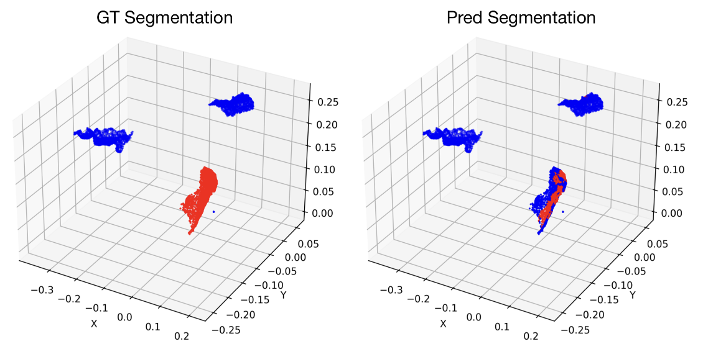
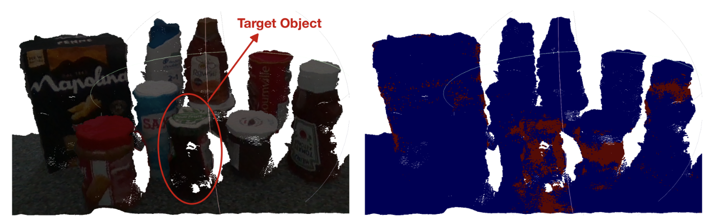

# Stratified Transformer (PyTorch) — MiniMarket Semantic Segmentation

Stratified Transformer implemented in PyTorch for 3D point‑cloud **semantic segmentation** (object vs. background) on MiniMarket‑style scenes. Train on HDF5 datasets and run inference on raw `.pcd` scenes.

---

## Quick Start

### 1) Environment
Create and activate the conda environment from the provided YAML:

```bash
# clone the repo
git clone https://github.com/Saravut-Lin/Stratified-Transformer.git
cd Stratified-Transformer

# create and activate the environment
conda env create -f stratified_env.yml
conda activate stratified   # or the name defined inside the YAML
```

---

### 2) Dataset
Generate the dataset using the **MiniMarket dataset processing** repo, then copy the produced HDF5 into this repo’s `dataset/market/` folder.

```bash
git clone https://github.com/msorour/MiniMarket_dataset_processing.git
cd MiniMarket_dataset_processing
# Follow that repo's instructions to produce the .h5 /.hdf5 file
```

Place the generated file here:

```text
Stratified-Transformer/
└─ dataset/
   └─ market/
      └─ jam_hartleys_strawberry_300gm_1200_2048_segmentation_20480_12000   # ← your generated file (name is up to you)
```

> If you use a different path/filename, adjust it in the config or pass overrides on the CLI.

---

### 3) Train
Run MiniMarket semantic‑segmentation training using the provided config:

```bash
python train_market.py --config config/market/market_stratified_transformer.yaml
# optional: python train_market.py -h
```

The script logs metrics and saves checkpoints under `runs/`; **note the best checkpoint path** (best epoch was ~70 in our runs).

---

### 4) Inference on real‑world scenes (`.pcd`)
Use your saved checkpoint to run inference on a PCD file. Example PCDs live under **`realworld_scene/`**.

**Generic usage**
```bash
python test_infer.py \
  --config config/market/market_stratified_transformer.yaml \
  --model_path runs/<your_run_name>/model/model_best.pth \
  --input_pcd realworld_scene/<scene>.pcd \
  --output_ply result/real_world/segmentation/<dest_dir>/<outfile>.ply \
  DATA.data_name=market TRAIN.voxel_size=0.02 TRAIN.max_num_neighbors=32 TRAIN.grid_size=0.02
```

**Example (from our experiments)**
```bash
python test_infer.py \
  --config /home/s2671222/Stratified-Transformer/config/market/market_stratified_transformer.yaml \
  --model_path /home/s2671222/Stratified-Transformer/runs/market_stratified_transformer3/model/model_best.pth \
  --input_pcd /home/s2671222/Stratified-Transformer/realworld_scene/realworld_scene_1.pcd \
  --output_ply /home/s2671222/Stratified-Transformer/result/real_world/segmentation/my_scene_mask/scene_mask111.ply \
  DATA.data_name=market \
  TRAIN.voxel_size=0.02 \
  TRAIN.max_num_neighbors=32 \
  TRAIN.grid_size=0.02
```

The inference utility voxelises the scene, supports chunk‑wise processing with voting, and writes a colorised `.ply` mask (red = target, blue = background).

---

## Results (Summary)

### Training performance
- Trained for **95 epochs** with early stopping (patience 25).
- Training mIoU: **0.3101 → 0.5443**; mAcc: **0.6652 → 0.8293**; allAcc: **0.4859 → 0.7537**.
- Best checkpoint occurred earlier at **epoch 70**.

**Validation example (best epoch 70)** — ground truth (left) and prediction (right):



### Validation performance
- Epoch 1: mIoU **0.4034**, mAcc **0.7457**, allAcc **0.6012**.
- **Peak** at epoch **70**: mIoU **0.7556**, mAcc **0.8504**, allAcc **0.9206**.
- Class IoUs at best epoch: background **0.9098**, target **0.6013**.
- By epoch 95: mIoU **0.6945** (IoU **0.8477/0.5414** for bg/obj), mAcc **0.9032**, allAcc **0.8709**.
- Patterns: accuracy can remain high under class imbalance even when IoU softens.

### Real‑world PCD inference
- Using the voxelised, chunk‑wise pipeline, mean runtime was **115.17 s** per scene over 10 PCDs (range **71.55–147.82 s**).
- Typical outcome: fragmented target mask, false‑positive islands on neighbouring bottles/surfaces, and background speckle. Boundaries are not coherent, so the model often fails the qualitative pass criterion in clutter.



> In practice, larger `TRAIN.voxel_size` values can speed up inference but may further degrade boundary quality.

---

## Repository Layout

```text
Stratified-Transformer/
├─ train_market.py                    # training entry point (MiniMarket)
├─ test_infer.py                      # inference on real-world PCDs
├─ config/market/market_stratified_transformer.yaml
├─ dataset/
│  └─ market/                         # place your generated HDF5 file here
├─ realworld_scene/                    # example PCD scenes for inference
├─ runs/                               # training outputs (checkpoints, logs)
├─ result/real_world/segmentation/     # inference outputs (.ply masks)
├─ figs/                               # figures used in this README
└─ stratified_env.yml                  # conda environment
```

---

## Tips & Troubleshooting
- **Speed vs. quality:** Increase `TRAIN.voxel_size`/`TRAIN.grid_size` to speed up inference; decrease for finer masks (higher memory/time cost).
- **Neighbors:** `TRAIN.max_num_neighbors` controls local attention neighborhoods; tune alongside voxel/grid size.
- **OOM / memory:** Reduce batch size or voxel density; ensure swap is enabled if training on limited GPUs.
- **Paths:** Double‑check dataset and checkpoint paths and CLI overrides.

---

## Acknowledgments
- **Model:** Stratified Transformer for 3D point cloud segmentation.
- **Dataset preparation:** [MiniMarket_dataset_processing](https://github.com/msorour/MiniMarket_dataset_processing).

---

## License
See the repository’s `LICENSE` file.

---

## Reproduction checklist
- [x] `conda env create -f stratified_env.yml && conda activate stratified`
- [x] Generate HDF5 with `MiniMarket_dataset_processing` → place in `./dataset/market/`
- [x] `python train_market.py --config config/market/market_stratified_transformer.yaml` → note best checkpoint (e.g., epoch 70)
- [x] `python test_infer.py --config ... --model_path ... --input_pcd realworld_scene/<scene>.pcd --output_ply result/real_world/segmentation/<dir>/<file>.ply`
- [x] Tune voxel/grid size and neighbors as needed for your hardware